
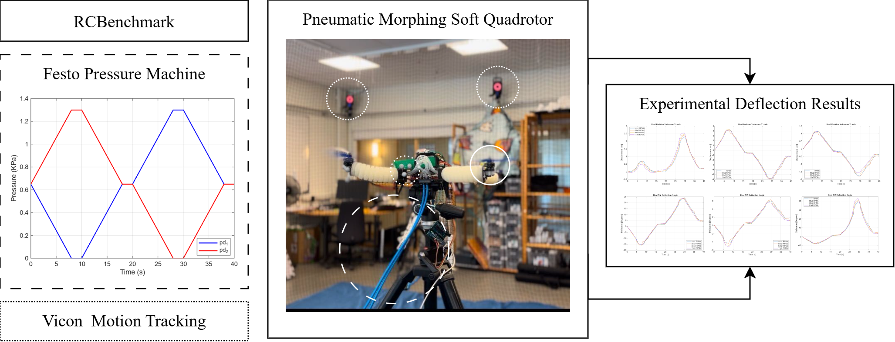

# Pneumatic Morphing Soft Quadrotor (v25.12)

This repository includes the SofaPython3 scene for the dynamic modelling of the Pneumatic Morphing Soft Quadrotor (PMSQ) and the associated code for its experimental validation.

## Overview
Click on the image for a better resolution.

<p align="center">
  
</p>

## Citation

### Modeling and Control of a Pneumatic Morphing Soft Quadrotor based on the SOFA Framework for Dynamic Soft Robotic Simulation
#### F. Labra Caso, V. Sumathy, P. Ferrentino, B. Vanderborght, J. Haluska and G. Nikolakopoulos
```
@misc{caso2026modelingcontrolpneumaticmorphing,
      title={Modeling and Control of a Pneumatic Morphing Soft Quadrotor based on the SOFA Framework for Dynamic Soft Robotic Simulation}, 
      author={F. Labra Caso and V. Sumathy and P. Ferrentino and B. Vanderborght and J. Haluska and G. Nikolakopoulos},
      year={2026},
      eprint={2605.21031},
      archivePrefix={arXiv},
      primaryClass={cs.RO},
      url={https://arxiv.org/abs/2605.21031}, 
}
```
### Experimentally Validated Dynamic FEM-based Modeling of a Pneumatic Morphing Soft Quadrotor
#### V. Sumathy, F. Labra Caso, P. Ferrentino, J. Haluska, B. Vanderborght and G. Nikolakopoulos
```
... Under Review ...
```

## SOFA Scene

```
#################################
#      Container Deployment     #
#################################

# Start container with environment variables
bash docker/docker.sh

# Attach terminal to Docker container
docker exec -it sofa bash

#################################
#        SOFA GUI Launch        #
#################################

# Update executable list with runSofa
export PATH=/sofa/build/bin:$PATH

# Start SOFA GUI, loading SofaPython3 plugin
runSofa -l SofaImGui -l SofaPython3 -g imgui

# Select 'Load File', navigate to src/ folder and choose the SOFA scene
# sofa.model.arm.py     (Single Pneumatic Arm              - Periodic Actuation)
# sofa.model.control.py (Single Pneumatic Arm              - PID Control)
# sofa.model.drone.py   (Pneumatic Morphing Soft Quadrotor - Periodic Actuation)
```


## Experimental Validation

```
# Build colcon workspace
cd colcon_ws && colcon build

# Start VICON Motion Capture driver
ros2 launch mocap4r2_vicon_driver mocap4r2_vicon_driver_launch.py

# Activate ROS2-VICON Interface
ros2 lifecycle set /mocap4r2_vicon_driver_node activate

# Publish PSMQ VICON poses
python3 src/vicon.publisher.py --ros-args \
  -p target_names:="['softdrone-base.softdrone-base','softdrone-tip.softdrone-tip']" \
  -p output_topics:="['/odom/softdrone/base','/odom/softdrone/tip']"

# Record position of base/tip of the PMSQ arm
ros2 bag record /odom/softdrone/base /odom/softdrone/tip
```
